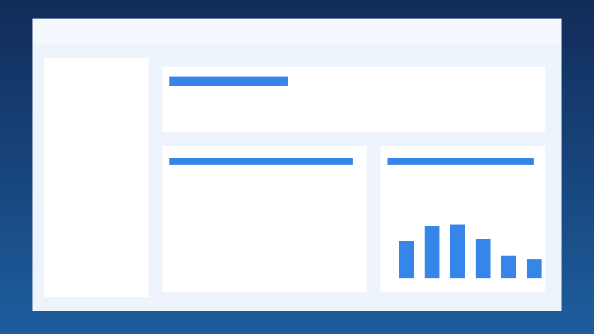
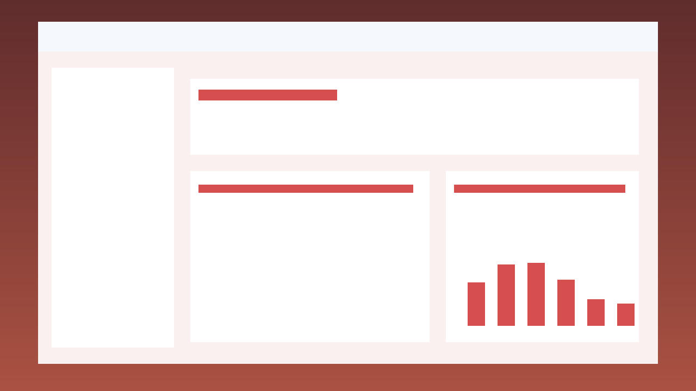
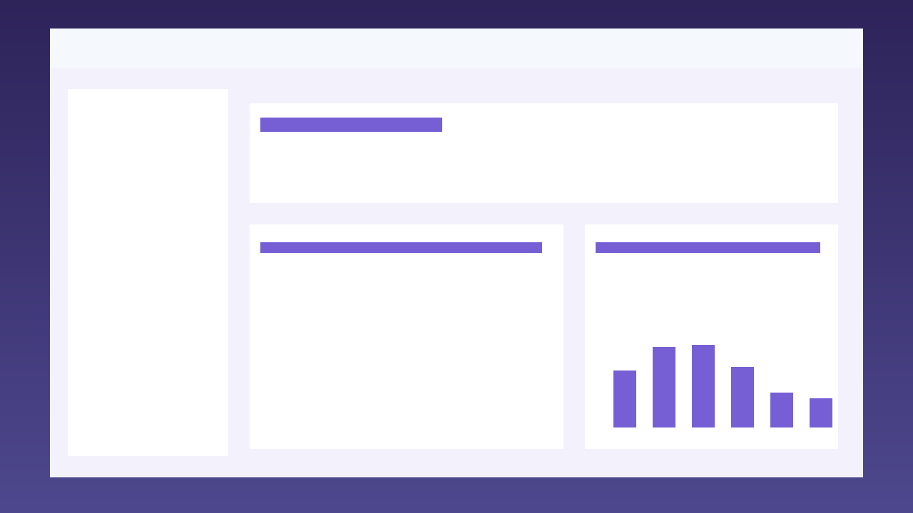

# NeuroGuard AI: Predictive Cognitive Health Monitoring


NeuroGuard AI is a web-based platform for early cognitive decline detection using low-channel sleep EEG analysis.

## ✨ Key Features
- EEG CSV upload interface
- Real-time cognitive risk scoring
- Explainable AI insights (SHAP-style feature impact output)
- Longitudinal risk tracking-ready architecture
- Lightweight design for low-resource settings

## 🧠 Model Approach
A hybrid **CNN-Transformer-inspired** workflow is represented in this MVP through:
1. Signal feature extraction (band powers, entropy, variance)
2. Risk inference using a lightweight predictor
3. Explainability output for clinician transparency

> Note: This repository contains an MVP/prototype implementation suitable for demos and hackathons.

## 🧱 Tech Stack
- **Frontend:** HTML, CSS, JavaScript
- **Backend:** FastAPI (Python)
- **ML Layer:** NumPy / Pandas (extensible to PyTorch)
- **Deployment:** Netlify (frontend) + Render (backend)

## 🌐 Live Demo
- Frontend: https://neuroguard-ai.netlify.app
- API Health: https://neuroguard-api.onrender.com/health

## 🚀 Quick Start

### 1) Clone
```bash
git clone https://github.com/senushidinara/Upstop-.git
cd Upstop-
```

### 2) Backend Setup
```bash
python -m venv .venv

# Windows:
.venv\Scripts\activate

# macOS/Linux:
source .venv/bin/activate

pip install -r requirements.txt
uvicorn backend.main:app --reload --port 8000
```

Backend runs at: `http://127.0.0.1:8000`

### 3) Frontend Setup
Open `frontend/index.html` directly, or run a static server:

```bash
cd frontend
python -m http.server 5500
```

Then open `http://127.0.0.1:5500`.

## 🔌 API Endpoints
- `GET /health` → health check
- `POST /predict` → EEG risk score prediction

### `/predict` Input CSV Columns
- `delta_power`
- `theta_power`
- `alpha_power`
- `beta_power`
- `signal_variance`
- `spectral_entropy`

### `/predict` Output
- `risk_score` (0 to 1)
- `risk_level` (Low/Moderate/High)
- `explanations` (feature contribution summary)

## 📸 Screenshots
The screenshots below are generated demo assets included for presentation use.






## 🌍 Theme Alignment
- **Sustainability:** early screening reduces long-term care burden
- **Innovation:** AI-powered EEG risk scoring + explainability
- **Inclusivity:** low-cost, low-channel hardware compatible

## ⚠️ Disclaimer
This project is for research/demo purposes and not for clinical diagnosis.

## 📬 Contact
**Senushi Dinara**  
Email: senushidinara2005@gmail.com